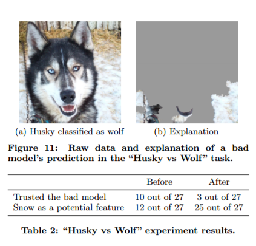

# Exercise: Why Didn't This Work?

Like any software system, ML systems sometimes fail. In this exercise you'll be broken into teams (4-5 people) and asked to discuss three prominent AI failures.

## Discussion Topics:

For each of the cases you should try to explore (at least) the following questions:

1. What would the training data look like for this system?
    * Try to define the features.
    * Try to define the labels.
2. Why did this system fail?
    * What are the potential sources of error (there are typically multiple!)
3. What could be done to mitigate this failure?
    * Would another algorithm do better?
    * Can we fix up the data?
    * Could we insert human checks to improve the result?

In each case your teams will be given 15 minutes to discuss the topic, then we'll reconvene as a class and discuss a bit further.

## The Topics:

### 1: Amazon's Resume Scanner

In 2018, Amazon [shut down a machine learning system it had built to scan resumes](https://www.reuters.com/article/us-amazon-com-jobs-automation-insight/amazon-scraps-secret-ai-recruiting-tool-that-showed-bias-against-women-idUSKCN1MK08G). Because the system was discriminating against women.

Some key facts:

* The algorithm was meant to take a resume and decide if that person should get a phone screen.
* The algorithm was trained with historical data from Amazon's existing workforce.
* The algorithm was not explicitly given any demographic information, only the raw text of each resume.
* The simple appearance of the word "woman" in a resume significantly reduced the chance that the algorithm would suggest a phone screen, but even when no obvious demographic information was included in the text, the algorithm still seemed to penalized women.

### 2: Wolf or Husky?

A famous finding in machine learning literature was uncovered when researchers built a neural network that attempted to distinguish between wolves and huskies. Researchers demonstrated that the pixels that were most important to the model's predictions weren't the animals, but rather the background! 

Some key facts:

* The algorithm seemed to be working initially, but when they started using data from alternate sources (rather than their initial training/test data) it started failing.
* After that they invented this system to show which pixels mattered.

### 3: Microsoft Tay: The AI That Learned To Love Hitler

In 2016, Microsoft deployed a machine learning system that was meant to mimic the way teenagers behave on Twitter. The AI was designed to continue learning as it had interactions with real people on Twitter. The whole premise is a little weird, but what happened when they deployed the system was even weirder. In less than 24 hours went from innocent tweets like, "humans are super cool" to tweeting: "Repeat after me, Hitler did nothing wrong."

Some key facts:

* The algorithm was trained initially with a curated dataset built by Microsoft, but was allowed to learn from its interactions on Twitter directly once it was published.
* Likes, retweets, and mentions were all used in the "online" training process.
