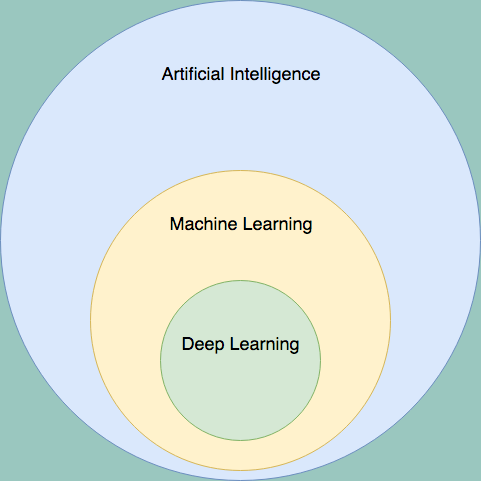
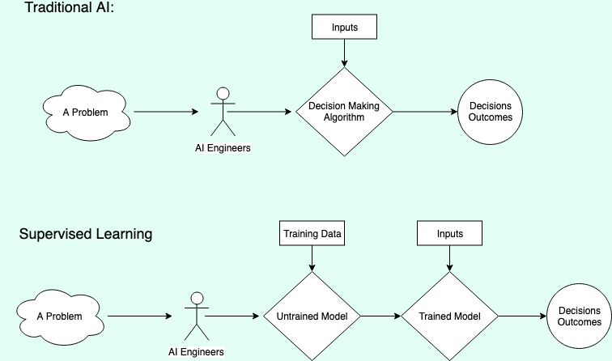
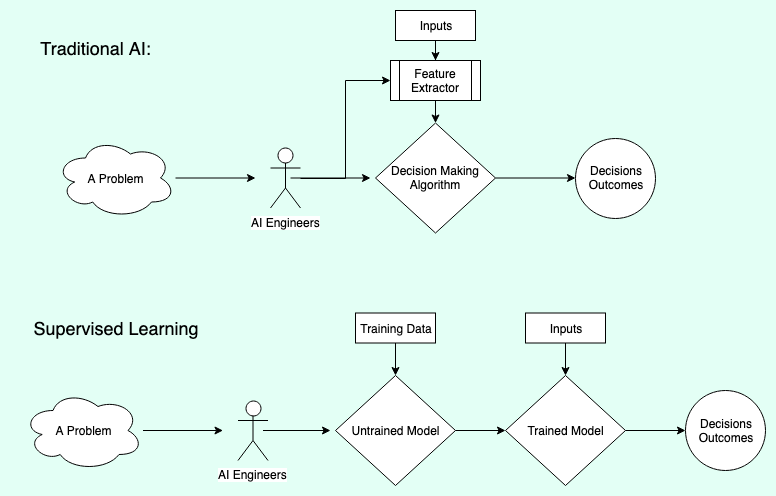
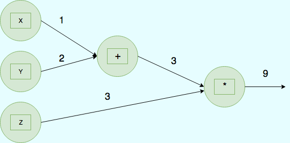
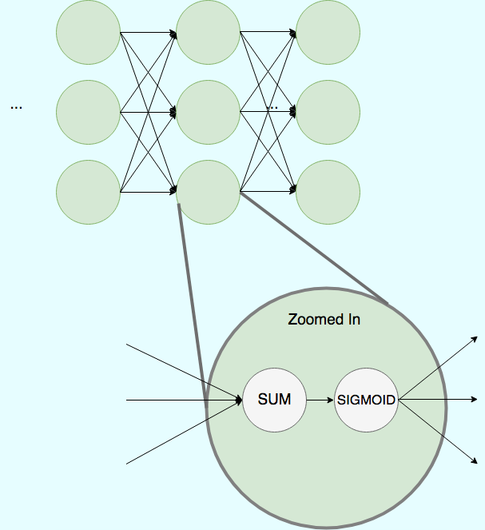
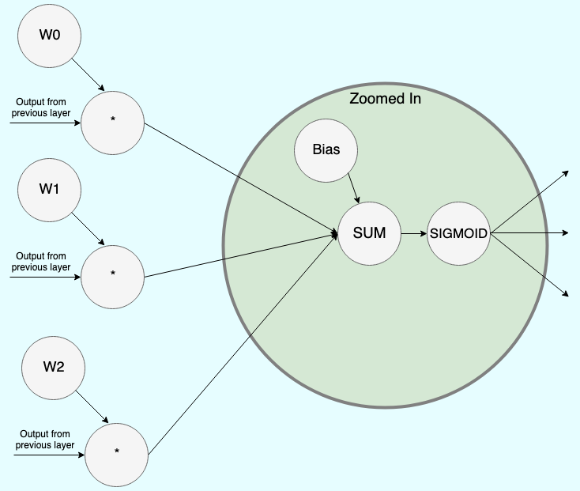

# Introduction to Deep Learning

Deep learning is a subset of machine learning, which is itself a subset of artificial intelligence:



AI is a very broad field whose definition seems to change all the time, for our purposes lets assume AI covers **any computer system designed to automate decision making.** It's not a perfect definition, but it helps us think historically. Early AI systems, under this definition, would include rule based hierarchies. Large nested if statements handling all the possible states. 

Indeed, classical AI systems do not "learn" but instead humans learned a great deal about the problem, then created special algorithms to work in those domains. In many domains, like robotic path planning, these types of AI's are still the state of the art, outperforming machine learning alternatives. 

Machine learning is a subset of AI where an algorithm takes examples as input, and changes the output based on those examples. There are a few kinds of machine learning, including:

* Supervised learning
* Reinforcement learning
* Unsupervised learning
* Semi-supervised learning

In this class we'll look at one form of supervised learning (deep learning) and later in the course how to combine deep learning with reinforcement learning. We will not discuss any unsupervised or semi-supervised learning concepts. 



# Benefits of Machine Learning

If you had to write a computer program to detect pictures of birds... where would you start? Here is a "classical AI" approach:

* First I'd write some code that could detect edges in a photograph.
* Then I'd add some code that could extract shapes based on those edges.
* Then I'd manually define all the shapes that birds can have in photographs.
* Then I'd process an image, extract the shapes, and compare them to the shapes of birds. 

The first two parts of this process are often called "feature extraction" and it can be quite a challenge for some kinds of data, images included. The 3rd part of this would be exhausting: can you really enumerate all the shapes that birds could take in a photograph?

In traditional AI humans would create specific algorithms for feature extraction, and then they would manually create algorithms to process those features. In some machine learning contexts, feature extraction is still a part of the process, but often (and especially with deep learning) feature extraction is automated as part of the training process.



Machine learning models have become the state-of-the-art in many AI domains, especially in domains where feature extraction is hard to do, such as computer vision. Some of the most popular ML models are neural networks, a class of very flexible models that excel at feature extraction.

# Neural Networks and Deep Learning

Deep learning is a subset of supervised learning that makes use of a class of models called neural networks. The first neural networks were **inspired** by the way biological neurons work. The fundamental unit of a deep neural network is often called a "neuron" because of this history. **However, the connection between biological brains and deep neural networks is mostly superficial** a better way to think about neural networks is as a mathematical function. 

**The fundamental hypothesis of deep learning is that a mathematical function exists that can map the values of our input data to the labels of that input data.** The purpose of training a neural network is to find that mathematical function through trial and error. In order to understand how this works, it's very useful to think of neural networks in terms of a "computational graph". Consider this:

```
F(x, y, z) = (x + y) * z
F(1, 2, 3) = 9
```



This is a graph structure that represents the function above. Data flows through this network from the left to the right. The nodes represent a mathematical operation to apply, the inbound edges represent the values to be processed by a node, and the outbound edges represent the result of that operation being applied to the inputs. 

Deep Neural Networks are a special type of computational graph. These graphs have a series of layers where the first layer is made of nodes representing a single example from our data, and the last layer represents the output or prediction from our network. The input and output layers are called "visible layers". Between the input and output layer are a series of "fully connected" layers: 



Each node in the hidden layers has an input edge from each of the nodes in the prior layer, and has an outbound edge connected to each of the nodes in the subsequent layer. All the input values are summed, and that sum is sent to an "activation function" (in this example the "sigmoid" function). We will look at several popular activation functions in more detail later, but it's purpose is more or less to control and bound the output of any one neuron.

If we zoom in closer we will see the key features that are changed while "training" a neural network":



Modern nerual networks combine several layers (hence "deep" neural networks) and these layers have often have hundreds to thousands of nodes each. Notice the **weights** w0-w2, and the **bias**. Each edge has a weight that is multiplied by the value coming into the node before the sum, and each neuron has a **bias** that is added to the sum of the incoming values. (The bias is optional, but very common). Finally, the weighted input is passed to the **activation function** which again, is the **sigmoid function** in this example. 

The result of the activation function is then passed as output to **all** the nodes in the next layer. 

The **weights** and **biases** are the things that change during training. 

## One Concrete Example, MNIST:

* Describe an ANN that could be used to classify the MNIST dataset. Include the following details:
    * One-hot encoding and the shape of the final layer.
    * The "categorical cross entropy" loss function
    * Some possible architectures for the Network and their strengths/weaknesses.
    * Training and the concept of "epochs" 
    * The general non-use of "cross validation" in neural networks and why.