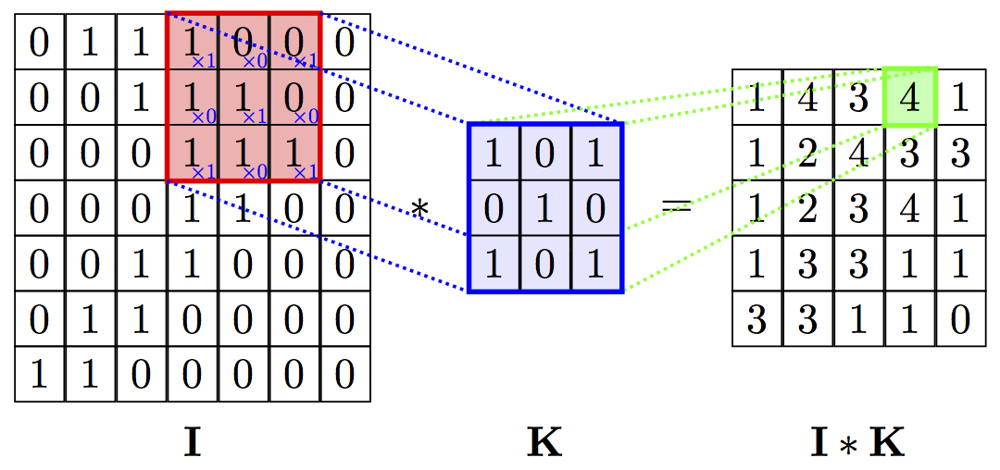
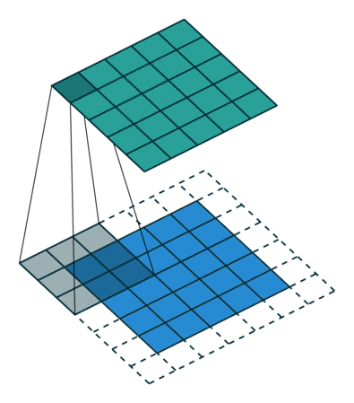
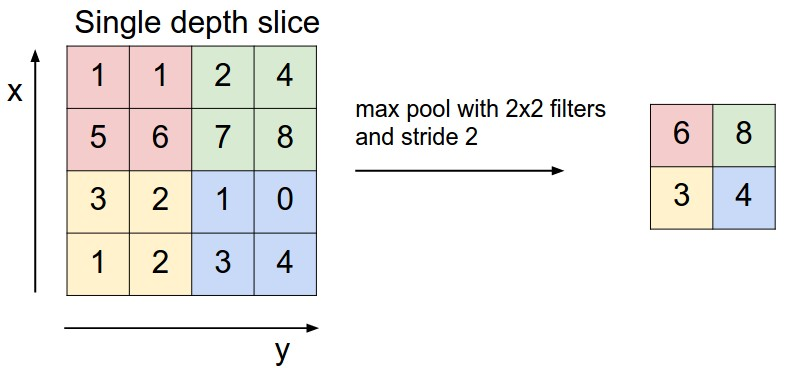

# Convolutional Neural Networks

CNNs are a twist on the neural network concept designed specifically to process data with spatial relationships. In the deep neural networks we've seen so far every node is always connected to every other node in the subsequent layer. While spatial relationships CAN be captured, as we've seen with out results on MNIST, the networks were not explicitly built with the assumption that spatial relationships definitely exist. Artificial neural networks are perfectly appropriate for data where the relationships are not spatial. 

But, for data such as images, it seems crazy to ignore the spatial relationships! For the vast majority of image data, neighboring pixels combined with each other tell us much more than combining the pixels in opposite corners or the image. CNN's rely on the assumption that our data has spatial relationships, and they have produced state-of-the-art results especially in image processing and computer vision. 

The fundamental unit of a CNN is a "convolution":



> Image Source: https://github.com/PetarV-/TikZ/tree/master/2D%20Convolution

The key component of the convolution is called the kernel, which is a matrix. K in the image above. The kernel has a shape, 3x3 in this example, but we can define the for each convolution. We "slide" the kernel across every 3x3 section of the image performing item-by-item multiplication, for example in the above image the 4 highlighted in green is produced by taking the values highlighted in red, multiplying the values in the same position in the kernel, and summing the result of those multiplications. Specifically:


```
position:  [0,0]   [0,1]   [0,2]     [1,0]   [1,1]   [1,2]     [2,0]   [2,1]   [2,2]
operation: (1*1) + (0*0) + (0*1)  +  (1*0) + (1*1) + (0*0)  +  (1*1) + (1*0) + (1*1) == 4
```

This value is (optionally, but typically) then passed through a non-linearity like ReLU or Sigmoid before it is passed to the next layer. 

> Side note: In the literature, you'll discover that in a "true" convolution the kernel is inverted prior to the multiply+sum operation, and that this operation without the inversion is actually called "cross correlation" by most mathematicians. This matters in some contexts but we typically ignore it in deep learning because the values of the kernel are the things that are fine tuned, and storing them as "pre-inverted" matrixes is computationally efficent compared to inverting the kernel repeatedly. 

Here is a helpful animation to visualize convolutions:



> Image source: https://towardsdatascience.com/types-of-convolutions-in-deep-learning-717013397f4d

## Important Terms:

A convolutional layer has a few important properties:

* **Number of kernels** -- this is similar to the number of nodes in an ANN
    * Each kernel will be separately trained on the input data. 
    * Each kernel will produce an output layer, sometimes called a feature map.
    * These feature maps are used as input to the next layer.
* **Kernel size** -- these are almost always 3x3 or 5x5. 
    * Bigger kernels are more computationally expensive.
    * Bigger kernals have a wider "field of view" which can be helpful.
    * Dialted convolutions can capture a wider field of view at a lower computational cost (see additional resources).
* **Padding** -- notice above that a convolution produces a smaller output layer than the input layer by 1 pixel in each direction. Padding the input (typically with 0 values) allows the convolution to produce an output with the same size as the input. 
    * Downsampling to smaller sizes isn't always bad.
    * It reduces the computational costs at the next layer. 
    * If we don't pad, it limits the possible depth of the network esp. for small inputs
    * Padding tends to preserve information at the borders. If your images have important features on the edges, padding can improve performance
* **Stride** -- in the above we "slide" the kernel over by 1 pixel at every step. Increasing the stride increases the amount we slide by. 
    * Stride is typically set to 1. 
    * Higher values reduce the amount of information captured.
    * Higher values are more computationally efficent, as fewer values are combined per convolution.

## Pooling and Striding

One last important concept before we build a CNN: pooling. Pooling is a tactic used to decrease the resolution of our feature maps, and it is largely an issue of computational efficency. There are 2 popular kinds, max pooling and average pooling. Pooling layers use a window size, say 2x2, and take either the max or average value within each window to produce the output layer. The windows are almost always square, and the stride size is almost always set to the size of the window:



> Image source: https://cs231n.github.io/convolutional-networks/

It is worth noting that pooling has fallen out of favor in a lot of modern architectures. Many machine learning practitioners have started downsampling through convolutions with larger stride sizes instead of pooling. 

## Most Common Tasks:

(describe the final layers/loss functions for each of these tasks)

* Classification
* Object Localization
* Segmentation

## Important Architectural Concepts

### Feature Extraction vs Task Performance

* Early layers are more general, and do feature extraction.
* Commonly a series of non-convolutional layers are added after the convoluitonal layers to perform classification / regression tasks
    * Flatten vs Global Average Pooling
* Segmentation is usually all convolutional.


### Input Size Restrictions

* Most CNN's still require a fixed size input, so image padding and scaling are commonly used.
* There are ways to allow many differently sized inputs to work, although typically they still require a minimum size they can handle any sizes larger than that.
    * Such systems must use global average pooling, and cannot use flatten, when transitioning from convolutional to ANN layers.

### Skip Layers / Residuals

Skip layers allow us to send information directly from earlier layers to later layers without being transformed by the layers inbetween. This tactic was invented to solve a varient of the the "vanishing gradient" problem. With skip layers we can forward signals from the original image and layer them on top of activation maps produced at later layers. We also use the skip layers during backpropagation, which causes helps the gradient values flow backwards through the network without becoming so diminished that the early layers never change.

This tactic is only needed as our networks become very deep. Just like ANN's with Sigmoid layers, CNN's can suffer from a vanishing gradient problem and these skip layers were a massive innovation in the history of CNN's that has really allowed "deep" learning with CNNs to thrive. 

In the following example, the skip layers are overkill and probably won't even help much. But for completenes we should see how to build them as nearly every SOTA CNN architecture includes this concept.

### Synthetic Data Generation / Image Augmentation / Preparation

* Flipping / Rotating
* Adversarial image perturbation (e.g. adding noise)
* Scaling and normalization w/ image data
