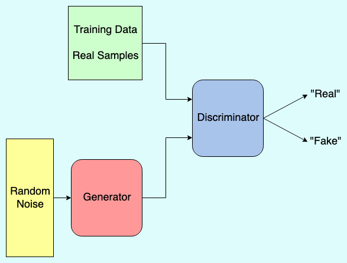

# Generative Adversarial Networks and MNIST

Generative adversarial networks are actually a combination of two neural networks called the Generator and Discriminator:

The input for the discriminator is always either a sample from the training data, or a sample created by the generator. Using this setup, the discriminator is typically a binary classifier: Its job is to classify samples as real examples (i.e. samples from the training set) or fake examples (i.e. examples created by the generator). The generator's job, then, is to produce data that realistically mimics samples from the training set. In order to force the generator to create many different samples we provide random noise as input to the generator. 