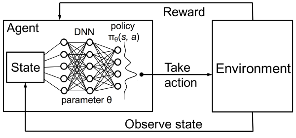
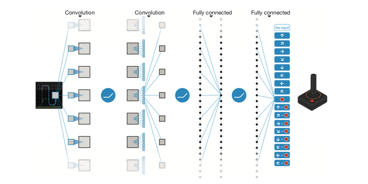

# Intro to Deep Q-Networks

Deep Q-Networks are a way to marry the concepts of Neural Networks and Reinforcement Learning. Specifically, instead of maintaining a Q-table that maps states to possible actions we use a neural network to provide that mapping. Our Neural Network takes the state information as input and its output layer represents the available actions. Every time we make an action we train the neural network based on the Q function for rewards, just as we did in the Q table. 

> Image Source: https://people.csail.mit.edu/hongzi/content/publications/DeepRM-HotNets16.pdf

# CNNs and DQNs: Playing From Pixels

Instead of relying on some kind of state transformer—that is some way to get relevant state information from the game itself—we can use CNN's and use a short sequence of screen captures of the pixels on the screen as the state. Doing so models the way humans play games (we don't know the internal state values) and is a much more general approach (every video game involves frames of pixels). 

> Image Source: https://storage.googleapis.com/deepmind-media/dqn/DQNNaturePaper.pdf

